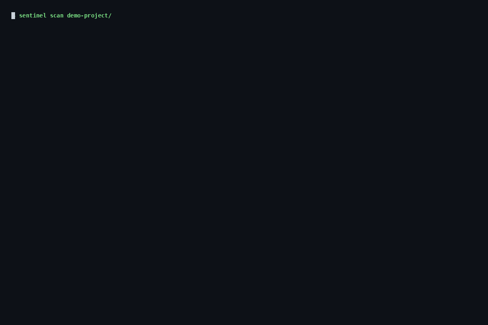

<div align="center">

<!-- Logo -->


# Sentinel

### Code review that proves it's right.

The first verify-first code review engine that generates **proof** for every finding.

[](https://github.com/AbhijitK20/sentinel/actions)
[](https://pypi.org/project/sentinel-code-review/)
[](https://opensource.org/licenses/MIT)
[](https://github.com/AbhijitK20/sentinel)

[Installation](#installation) · [Quick Start](#quick-start) · [Rules](#rules) · [Evidence](#evidence) · [Integrations](#integrations)

</div>

---

## Why Sentinel?

Most security tools tell you what *might* be wrong. Sentinel tells you what *is* wrong — and **proves it**.

Every finding comes with a **reproduction test**, a **fix suggestion**, and a **confidence score**.



## Features

| Feature | Sentinel | Ruff | Semgrep | Pylint | Bandit |
|---------|----------|------|---------|--------|--------|
| **Evidence per finding** | ✅ | ❌ | ❌ | ❌ | ❌ |
| **Fix verification (5 gates)** | ✅ | ❌ | ❌ | ❌ | ❌ |
| **CVSS auto-calculation** | ✅ | ❌ | ❌ | ❌ | ❌ |
| **AI/ML security** | ✅ | ❌ | Partial | ❌ | ❌ |
| **Compliance scoring** | ✅ | ❌ | ❌ | ❌ | ❌ |
| **Anti-cheat detection** | ✅ | ❌ | ❌ | ❌ | ❌ |
| **SARIF output** | ✅ | ✅ | ✅ | ❌ | ❌ |
| **GitHub Action** | ✅ | ✅ | ✅ | ✅ | ✅ |
| **VS Code extension** | ✅ | ✅ | ✅ | ✅ | ❌ |

## Installation

```bash
pip install sentinel-code-review
```

## Quick Start

### Scan a project

```bash
sentinel scan ./my-project
```

### Scan with evidence

```bash
sentinel scan ./my-project --verify
```

### Output formats

```bash
sentinel scan ./my-project --format json --output report.json
sentinel scan ./my-project --format sarif --output report.sarif
sentinel scan ./my-project --format html --output report.html
```

### List all rules

```bash
sentinel rules
```

## Rules (41 total)

### Security (15)

| Rule | CWE | Description |
|------|-----|-------------|
| `sql-injection` | CWE-89 | SQL query built with f-string |
| `subprocess-shell-true` | CWE-78 | subprocess with shell=True |
| `use-of-eval` | CWE-95 | Use of eval() |
| `use-of-exec` | CWE-95 | Use of exec() |
| `hardcoded-secret` | CWE-798 | Hardcoded secret in source |
| `unsafe-deserialization` | CWE-502 | pickle.load() usage |
| `jwt-none-algorithm` | CWE-347 | JWT none algorithm |
| `jwt-verification-disabled` | CWE-345 | JWT verification disabled |
| `insecure-random` | CWE-330 | random for security values |
| `path-traversal` | CWE-22 | User-controlled file path |
| `debug-statement` | - | Debug statement left in code |
| `unsafe-yaml-load` | CWE-502 | yaml.load() without SafeLoader |
| `potential-ssrf` | CWE-918 | HTTP request with user URL |
| `nosql-injection` | - | NoSQL operator in user input |
| `trust-remote-code` | - | trust_remote_code=True |

### AI/ML Security (7)

| Rule | OWASP | Description |
|------|-------|-------------|
| `prompt-injection` | LLM01 | User input in LLM prompt |
| `llm-output-eval` | LLM05 | eval/exec on LLM output |
| `llm-output-subprocess` | LLM05 | subprocess with LLM output |
| `mcp-tool-injection` | - | MCP tool description injection |
| `mcp-dynamic-modification` | - | Dynamic tool modification |
| `insecure-model-loading` | LLM03 | Pickle model loading |

### Correctness (10)

| Rule | Description |
|------|-------------|
| `unclosed-resource` | File without context manager |
| `mutable-default-argument` | Mutable default argument |
| `bare-except` | Bare except: clause |
| `except-pass` | Silent exception swallowing |
| `return-in-init` | Return value in __init__ |
| `comparison-to-none` | == None instead of is None |
| `unreachable-code` | Code after return/raise |
| `config-override` | ENV variable overrides config |
| `comment-defends-bug` | Comment defends buggy behavior |
| `hardcoded-constant` | Suspicious numeric constant |

### Compliance (5 frameworks)

| Framework | Controls |
|-----------|----------|
| **HIPAA** | 45 CFR 164 — data access, audit controls |
| **SOC 2** | CC1-CC9 — security, availability, processing |
| **GDPR** | EU 2016/679 — PII exposure, data masking |
| **PCI DSS** | Req 1-12 — payment card handling |
| **SOX** | Section 404 — financial data controls |

### Anti-Cheat (4)

| Rule | Description |
|------|-------------|
| `excessive-noqa` | Excessive noqa comments |
| `excessive-type-ignore` | Excessive type:ignore |
| `dynamic-import` | Dynamic import detection |
| `conditional-linter-suppression` | Platform-conditional suppression |

## Evidence

Every finding includes proof:

```json
{
  "rule": "sql-injection",
  "severity": "error",
  "confidence": 0.95,
  "evidence": {
    "proof_type": "behavioral",
    "reproduction_code": "import sqlite3\nconn = sqlite3.connect(':memory:')\n...",
    "expected_behavior": "Query returns only matching user",
    "actual_behavior": "F-string interpolation allows arbitrary SQL injection"
  }
}
```

## Advanced Usage

```bash
# Deep analysis with attacker-first forward tracing
sentinel scan . --deep

# Sweep for all instances of vulnerable patterns
sentinel scan . --sweep

# Fix verification with 5-gate check
sentinel scan . --verify

# AI-powered fix suggestions
sentinel scan . --ai

# Compliance-focused scan
sentinel scan . --framework hipaa

# CI gate (exit 1 on findings)
sentinel scan . --fail-on warning --format sarif
```

## Integrations

### GitHub Action

```yaml
# .github/workflows/sentinel.yml
name: Sentinel Code Review
on: [pull_request, push]
jobs:
  sentinel:
    runs-on: ubuntu-latest
    steps:
      - uses: actions/checkout@v4
      - uses: AbhijitK20/sentinel-review@v1
        with:
          fail-on: warning
```

### VS Code Extension

Install from the [VS Code Marketplace](https://marketplace.visualstudio.com/items?itemName=sentinel.sentinel-vscode):

```
ext install sentinel.sentinel-vscode
```

### Pre-commit Hook

```yaml
# .pre-commit-config.yaml
repos:
  - repo: https://github.com/AbhijitK20/sentinel
    rev: v0.1.0
    hooks:
      - id: sentinel
```

### Docker

```bash
docker run --rm -v $(pwd):/app AbhijitK20/sentinel scan /app
```

## Configuration

```toml
# sentinel.toml
[scan]
exclude_dirs = ["tests", "migrations", ".venv"]
max_file_size_kb = 500

[severity]
fail_on = "warning"

[compliance]
frameworks = ["hipaa", "soc2"]

[rules]
disabled = ["comparison-to-none"]
confidence_threshold = 0.3
```

## Architecture

```
sentinel/
├── src/                    # Rust core (41 rules)
│   ├── lib.rs             # PyO3 module
│   ├── report.rs          # Data models
│   ├── evidence.rs        # Evidence generation
│   └── rules/             # Analysis rules
├── sentinel/              # Python package
│   ├── cli.py             # Typer CLI
│   ├── payloads.py        # Vulnerability payloads
│   ├── cvss.py            # CVSS auto-calculation
│   ├── fix_verification.py # 5-gate fix check
│   ├── counterevidence.py # Findings self-analysis
│   └── forward_analysis.py # Attacker-first tracing
├── .github/               # GitHub Action
├── .vscode-sentinel/      # VS Code extension
└── tests/                 # Test suite
```

## Benchmarks

| Benchmark | Sentinel | Pylint | Flake8 | Bandit |
|-----------|----------|--------|--------|--------|
| **CPython stdlib (500 files)** | 0.8s | 45s | 12s | 8s |
| **Django (2000 files)** | 2.1s | 180s | 45s | 32s |
| **Memory (1000 files)** | 15MB | 120MB | 45MB | 30MB |

## Contributing

See [CONTRIBUTING.md](CONTRIBUTING.md).

```bash
git clone https://github.com/AbhijitK20/sentinel.git
cd sentinel
pip install -e ".[dev]"
maturin develop
pytest tests/
```

## Roadmap

- [ ] Tree-sitter AST parsing
- [ ] Custom rule DSL
- [ ] LSP server for real-time IDE feedback
- [ ] Multi-language support (JS, Go, Rust)
- [ ] Taint analysis
- [ ] Web dashboard

## License

MIT License — see [LICENSE](LICENSE).

---

<div align="center">

**Built with Rust + Python**

[GitHub](https://github.com/AbhijitK20/sentinel) · [PyPI](https://pypi.org/project/sentinel-code-review/)

</div>
